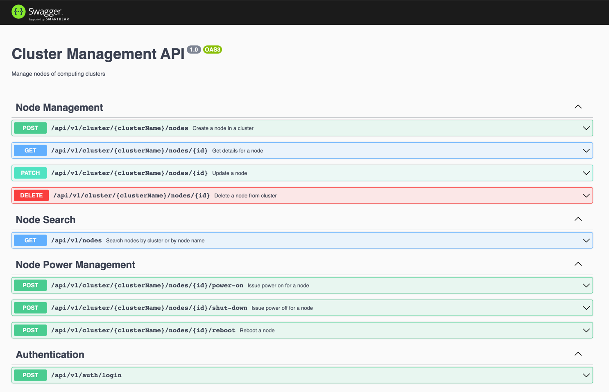

# Cluster Node API

## Getting started

### System requirements

-   git
-   docker
-   docker-compose

## Startup

A `Makefile` provides a couple of commands

```shell
$ make
Usage:
 make [target]

Available targets:
 help:            Help
 start:           starts platform
 recreate:        destroys containers and recreates platform
```
To startup the project just run `make start`.
Wait a bit for the containers to start and then browse [http://localhost:3000/api](http://localhost:3000/api) and you should see a Swagger UI



## Authentication
```text
username: john.doe
password: password
```
```shell
curl --request POST 'http://localhost:3000/api/v1/auth/login' \
--header 'Content-Type: application/json' \
--data-raw '{
    "username": "john.doe",
    "password": "password"
}'
```

it will give an access token that should be used to access other APIs

```shell
{
    "access_token": "<THE GENERATED TOKEN>"
}
```

```shell
curl --request GET 'http://localhost:3000/api/v1/<some endpoint>' \
--header 'Authorization: Bearer <THE GENERATED TOKEN>'
```

<details>
  <summary>See Assignment document!</summary>

# Interview Assignment - Cluster Node API

Hello, dear candidate! Thanks for taking the time to try this out.

The goal of this assignment is to assert (to some degree) your skills as a software engineer. You should focus on showcasing your skill at coding and problem solving. The solution is intentionally open-ended, to give you space for personal interpretation, but for all intents and purposes you can pretend that you're building a production-ready application!

You can develop the assignment in any common language you can demonstrate being comfortable coding with.

You're **allowed and encouraged** to use third party libraries and tools, as long as they are free and open source. An effective developer knows what to build and what to reuse, but also how his/her tools work. Be prepared to answer some questions about these, like why you chose them and what other alternatives you considered.

As this is a code review process, please minimize generated code, as this might make our jobs as reviewers more difficult.

_Note: While we love open source at SUSE, please do not create a public repo with your assignment in! This test is only shared with people interviewing, and for obvious reasons we'd like it to remain this way._

## Instructions

1. Clone this repository.
2. Create a pull request targeting the master branch of this repository.
   This PR should contain setup instructions for your application and a breakdown of the technologies & packages you chose to use, why you chose to use them, and the design decisions you made.
3. Reply to the email thread you're having with our HR department telling them we can start reviewing your code.

## Requirements

Create a simple API to manage nodes of computing clusters.
We'll refer to this as "The API" throughout the rest of this document.

There are two possible types of end users for this API: an unauthenticated one, and an authenticated one. We'll refer to these as "anonymous user" and "privileged user" respectively. The privileged user can implicitly also do everything the anonymous user can.

- As an anonymous user, I shall be able to access The API remotely.
- As an anonymous user, I shall be able to read a list of features The API offers.
- As an anonymous user, I shall be informed when trying to use a feature that is only available to privileged users.
- As a privileged user, I shall be able to search for nodes, either by node name or by cluster name.
- As a privileged user, I shall be able to create/read/update/delete nodes.
- As a privileged user, I shall be able to issue power-on/shutdown/reboot commands to a single node.

### Constraints and details

- The achitectural patterns, protocols and schemas used to implement The API are left as free design decisions.
- The only required entity handled by The API is a cluster _node_. Clusters are not required to be handled as a dedicated entity.
- The state represented by The API obviously doesn't have to be an actual cluster: the _single source of truth_ is expected to be simulated by any mean necessary (filesystem, database, object storage, etc); the only requirement is that such state must be persistent, i.e. restarting The API doesn't clear the data.
- The API itself doesn't _need_ to be "containerized" but, as a developer, I should be able to perform changes to the source code of The API and observe the results, by building/running it, on a Linux system which only provides an OCI container engine, without installing any new packages.
- Additional features you might want to autonomously define and implement are welcome!


## What to expect from the review

The review of your solution will happen in two phases:
1. First, you'll have a chance to interact with the interviewer[s] in a traditional asynchronous code review, like you would do on GitHub every day.
2. After the async peer review is done, we'll schedule a live chat with team, where further in-depth questions might be asked, to give you the chance to meet your potential future colleagues!

## Good luck

Code something awesome!

</details>